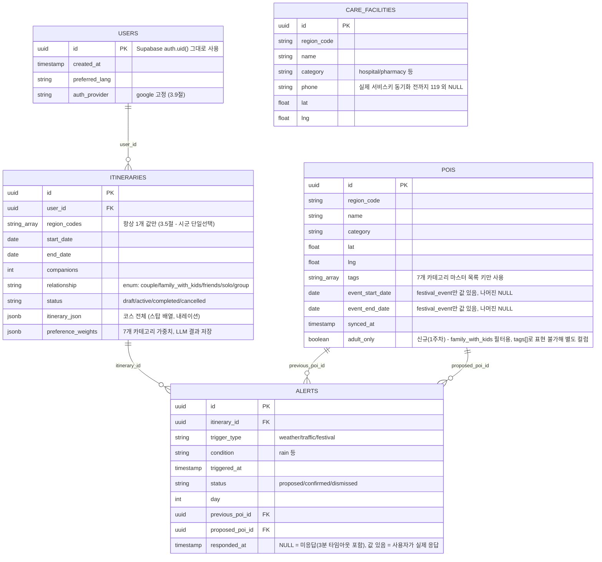
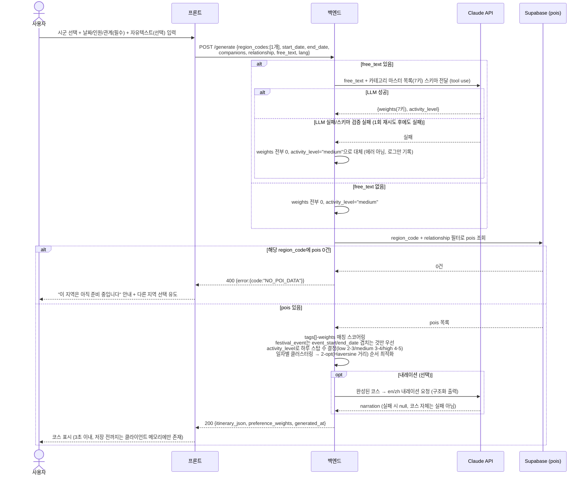
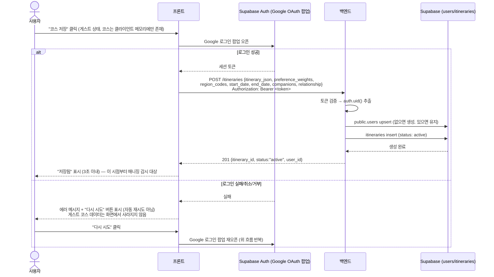
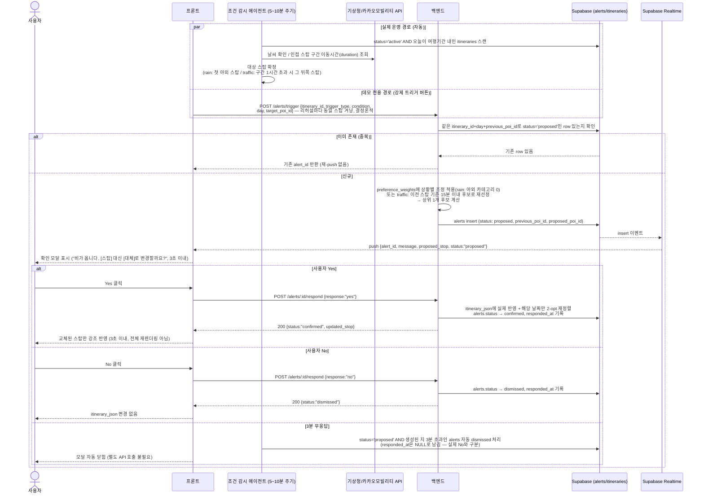
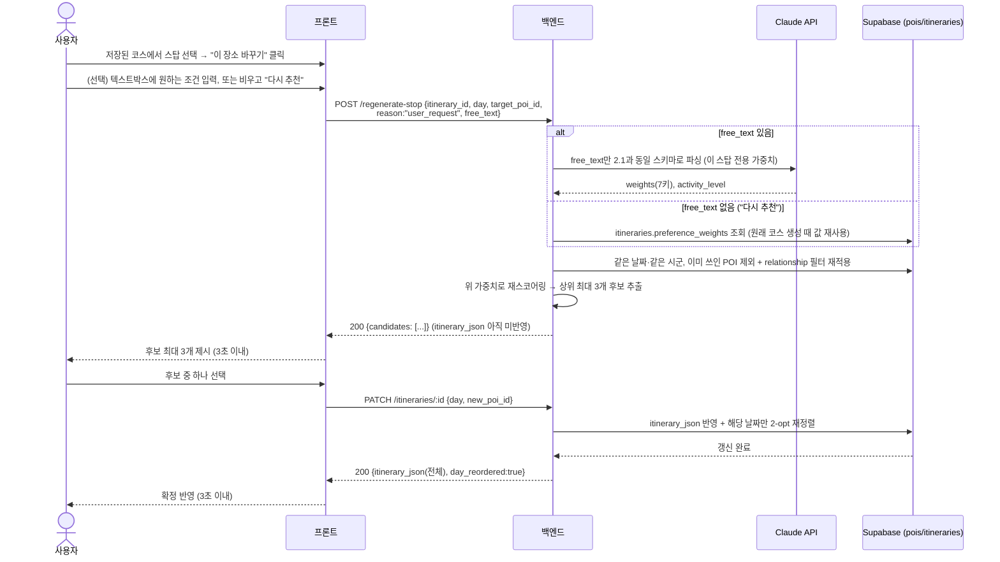

# GANGWON GO — ERD & 시퀀스 다이어그램

> PRD(`GANGWON_GO_PRD.md`)와 `API_CONTRACT.md`를 근거로 백엔드팀이 바로 참고할 수 있게 정리한
> 다이어그램입니다. 필드명·엔드포인트는 두 문서의 최신 확정 내용과 100% 일치합니다. 실제 구현 중
> 스키마가 바뀌면 **이 문서가 아니라 PRD 4장/API_CONTRACT.md를 먼저 갱신**하고, 이 문서는 그 뒤에
> 맞춰 갱신하세요(다이어그램은 파생 문서 — source of truth 아님).

---

## 1. ERD (데이터 모델, PRD 4장 기준)

**`itinerary_json` 스냅샷 정책 (확정)**: `itineraries.itinerary_json` 안에는 스탑마다 `poi_id`가
들어있지만, 이건 DB 레벨 FK가 아니라 JSONB 안의 값입니다(스키마 검증으로 강제 안 됨). **코스가
완성된 시점의 스냅샷을 그대로 유지하며, 표시할 때 `pois`와 다시 조인해서 최신값으로 갱신하지
않습니다.** 이유:

- 데모 여행 기간이 2~4일로 짧아 그 사이 `pois`의 이름/카테고리/좌표가 실제로 바뀔 확률이 낮음
- `pois`의 필드 자체가 "지금 영업 중인지" 같은 실시간성 정보가 아니라 애초에 자주 안 바뀌는 값들임
- 매니징/수동 편집(3.5절)이 어차피 "결정 순간엔 최신 `pois`로 스코어링 → 결과를 다시 스냅샷으로
  저장"하는 구조라, 코스가 바뀔 때마다 자연스럽게 최신 정보로 갱신됨 — 매번 조인할 필요가 없음
- 표시 시점 조인 방식은 `pois`에서 그 POI가 삭제/변경됐을 때 저장된 코스 화면이 깨지는 새로운
  실패 케이스를 만들 뿐, 3주 일정에 득보다 실이 큼

여행 케어 안내(`GET /api/care`)는 애초에 저장하지 않고 매번 새로 조회하므로 이 스냅샷 문제 자체가
없습니다 — 스냅샷 정책은 순수하게 `itinerary_json`(코스)에만 해당합니다. 나중에 정말 심각한 정정
(오타, 실제 폐업 등)이 필요한 극단적 경우는 자동 갱신 로직 없이 관리자가 해당 코스만 수동으로
재생성하는 걸로 충분합니다 — 이걸 위한 자동화는 만들지 않습니다.

---

## 2. 시퀀스 다이어그램

### 2.1 코스 생성 (게스트, 로그인 불필요) — `POST /api/itineraries/generate`

참고: PRD 3.5절, API_CONTRACT.md §1

---

### 2.2 게스트 → 로그인 저장 (재시도 흐름 포함) — `POST /api/itineraries`

참고: PRD 3.9절, API_CONTRACT.md §2

---

### 2.3 실시간 매니징 — 2단계 확인 흐름 (조건 감시 cron + 데모 강제 트리거, 3분 타임아웃 포함)

참고: PRD 3.5절/3.6절/11.5절, API_CONTRACT.md §3

---

### 2.4 코스 부분 수정 (사용자 직접) — `POST /api/itineraries/regenerate-stop` + `PATCH /api/itineraries/:id`

참고: PRD 2.1절/3.5절, API_CONTRACT.md §3

---

## 3. 이 문서를 만들며 새로 발견해 확정한 것

- §1의 "itinerary_json 스냅샷 vs pois 최신값" 문제는 이 문서를 만들다가 새로 눈에 띄어, 스냅샷
  유지(표시 시점 재조인 안 함)로 확정했습니다 — 근거는 §1 하단 참고.
